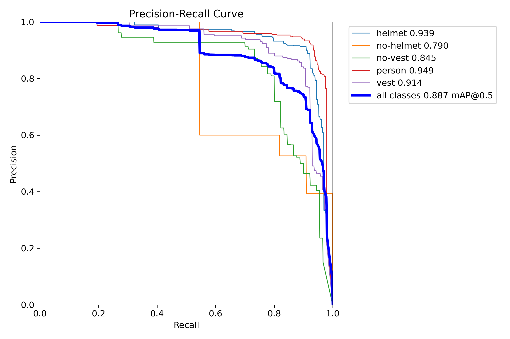
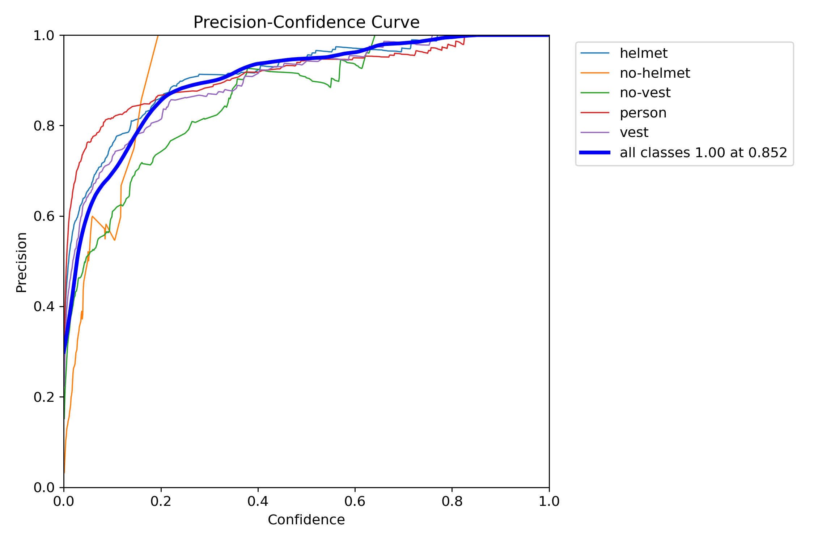
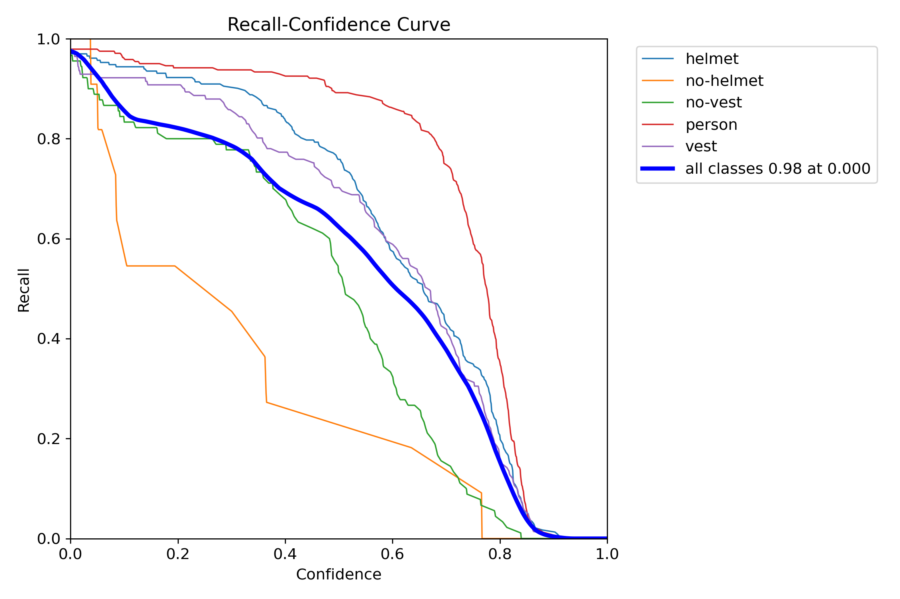
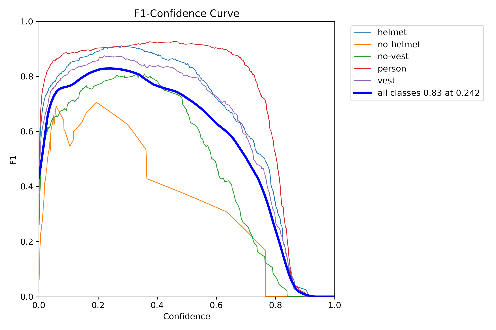
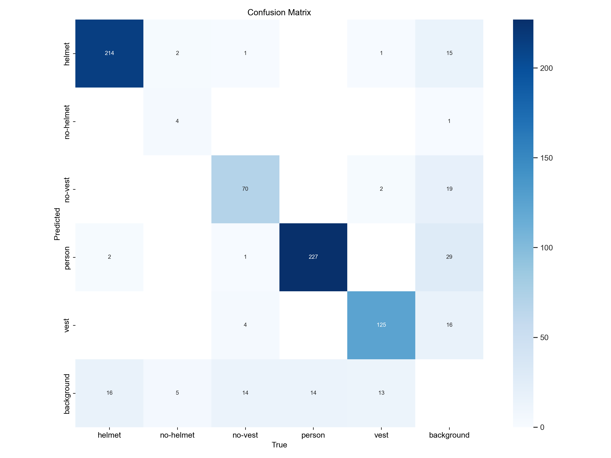
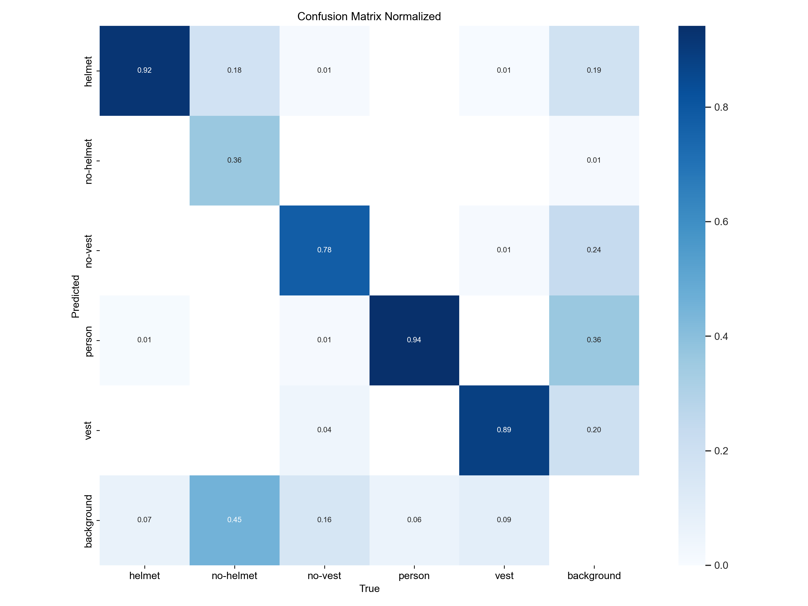
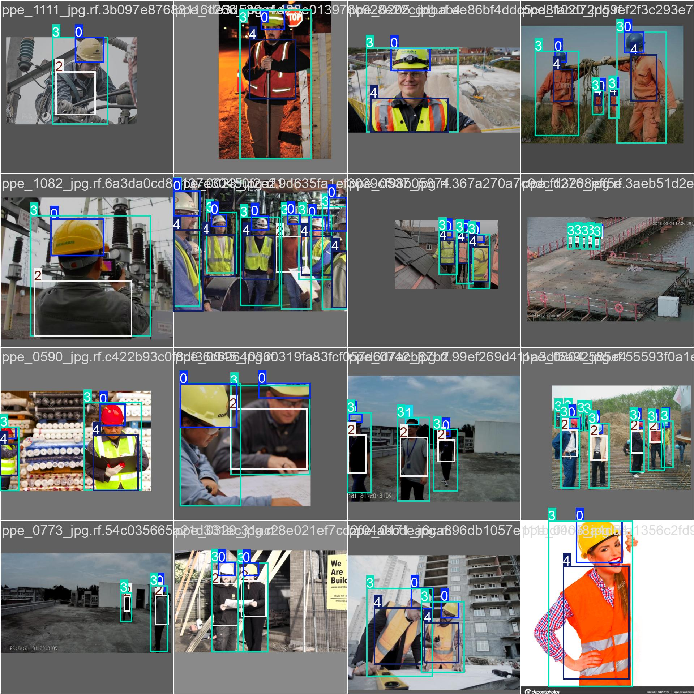
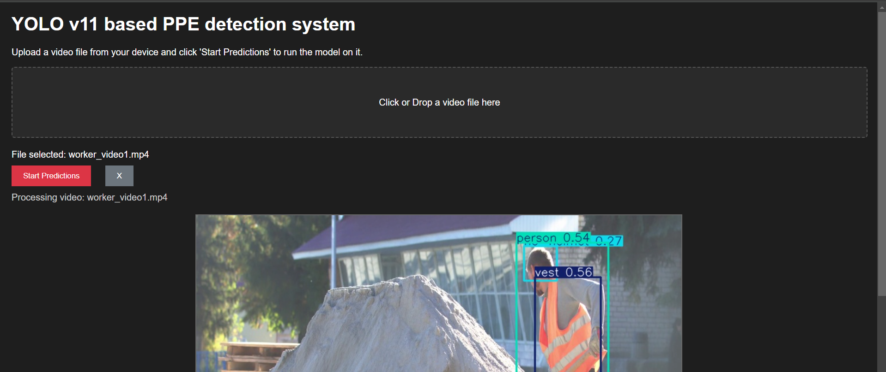

# YOLO v11 based PPE detection system

This repository contains the implementation of **YOLOv11** fine-tuned for detecting **Personal Protective Equipment (PPE)** in construction sites. The model is trained using a **Roboflow** dataset containing **1,206 images** annotated with five classes:  
- 🟢 `helmet`
- 🔴 `no-helmet`
- 🟡 `no-vest`
- 👷 `person`
- 🦺 `vest`

The model has been **hyperparameter tuned** to achieve **high precision and recall**, making it ideal for real-time detection of safety compliance.

## 👥 Contributors
| Name | Role |
|----------------------------|-----------|
| Ashlesh Patil (6351941) | Developer |
| Wasim Isak Sayyad (6351648) | Developer |


## 📂 Dataset
The dataset is sourced from [Roboflow](https://universe.roboflow.com/roboflow-100/construction-safety-gsnvb/dataset/2) and consists of:
- **Train set:** `train/images`
- **Validation set:** `valid/images`
- **Test set:** `test/images`
- **Number of Classes:** `5`
- **Class Labels:** `['helmet', 'no-helmet', 'no-vest', 'person', 'vest']`

The dataset is configured in `data.yaml` as follows:

```yaml
train: train/images
val: valid/images
test: test/images

nc: 5
names: ['helmet', 'no-helmet', 'no-vest', 'person', 'vest']
```

---

## 🚀 Installation & Setup
### 1️⃣ Clone the repository
```bash
git clone https://github.com/yourusername/YOLOv11-PPE-Detection.git
cd YOLOv11-PPE-Detection
```

### 2️⃣ Install dependencies
Make sure you have **Python 3.8+** and **pip** installed, then run:
```bash
pip install -r requirements.txt
```
> If using a GPU, install `torch` and `torchvision` accordingly and requirements.txt assumes you already have torch installed.

### 3️⃣ Download the dataset
- Extract or place the dataset inside `datasets/dataset/`
- Ensure `data.yaml` is correctly referenced in the scripts.

---

## 🏋️ Training the Model
We have already place best.pt which a fine tuned model, but if you want re-train then:
To train YOLOv11 from scratch or fine-tune on the PPE dataset, run(Ensure proper dataset configuration):

```bash
python train.py
```

The training script:
- Loads the `YOLOv11-nano` model (`yolo11n.pt`)
- Performs **hyperparameter tuning** for 300 iterations
- Saves the best-trained weights in `runs/detect/train6/best.pt`

**Best Hyperparameters Found:**
```yaml
lr0: 0.00919
lrf: 0.01
momentum: 0.86723
weight_decay: 0.00041
warmup_epochs: 2.54
warmup_momentum: 0.731
box: 0.198
cls: 0.427
dfl: 1.23
mosaic: 0.607
fliplr: 0.499
```

---

## 📈 Model Performance
The **best trained model** was evaluated, and the following results were obtained:

### 🟢 Precision-Recall Curve


### 🔵 Precision vs Confidence Curve


### 🔴 Recall vs Confidence Curve


### 🟡 F1-Confidence Curve


### 🏗️ Confusion Matrix


### 🔹 Normalized Confusion Matrix


> **Key Metrics:**
> - `mAP@0.5`: **0.887**
> - `mAP@0.5:0.95`: **0.504**
> - `Precision`: **0.94** (for `helmet`)
> - `Recall`: **0.80** (for `helmet`)

---

## 🖥️ Running the Detection API
A Flask-based API is provided in `main.py` for real-time video inference.

### 1️⃣ Start the API Server
```bash
python main.py
```

### 2️⃣ View the Live Detection Stream
Open a browser and visit:
```
http://127.0.0.1:5000/
```

### 3️⃣ Start the Detection Process

Upload a video file from directory and Start Predictions

### 4️⃣ Stop the Detection Process

### 5️⃣ Click 'X' and upload a new file for new Detection

---
## 📈 Model / Application Results
### Precditions on Image


### Application Image

---

## 📜 Notes & Future Work
- The model can be further improved using **data augmentation**.
- Future improvements include **model pruning** for edge device deployment.

---
