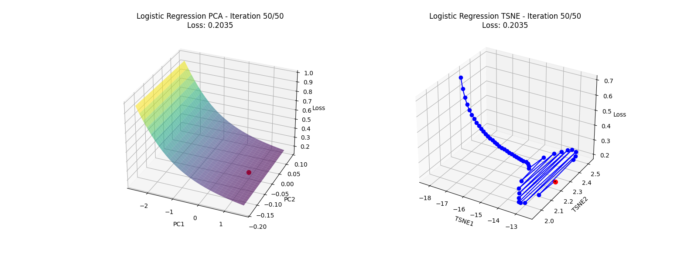
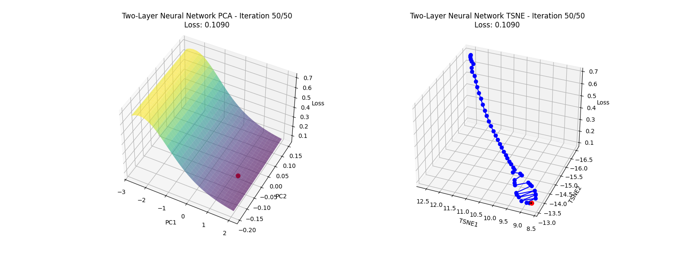

# Visualization of Gradient Descent (GD)

This project visualizes gradient descent optimization for logistic regression and a two-layer neural network using PCA and t-SNE projections. The code demonstrates how optimization trajectories evolve and how loss landscapes differ between convex and non-convex functions.

## Features
1. Implements logistic regression and a two-layer neural network.
2. Uses gradient descent for optimization.
3. Projects optimization trajectories using Principal Component Analysis (PCA) and t-SNE.
4. 3D visualization of the loss landscape and parameter trajectory.

## Run the Project:
1. Install Dependencies: 
```bash
pip install -r requirements.txt
```

2. Run run the script:
```bash
python Visualization.py
```

## Results


## This is an extra mini-project for a grade bonus.